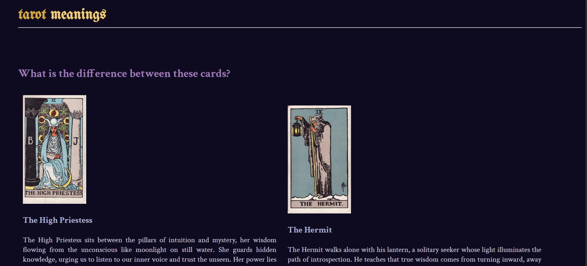
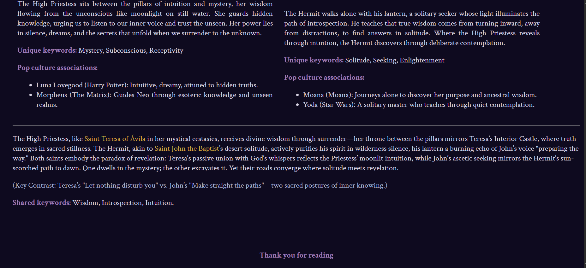
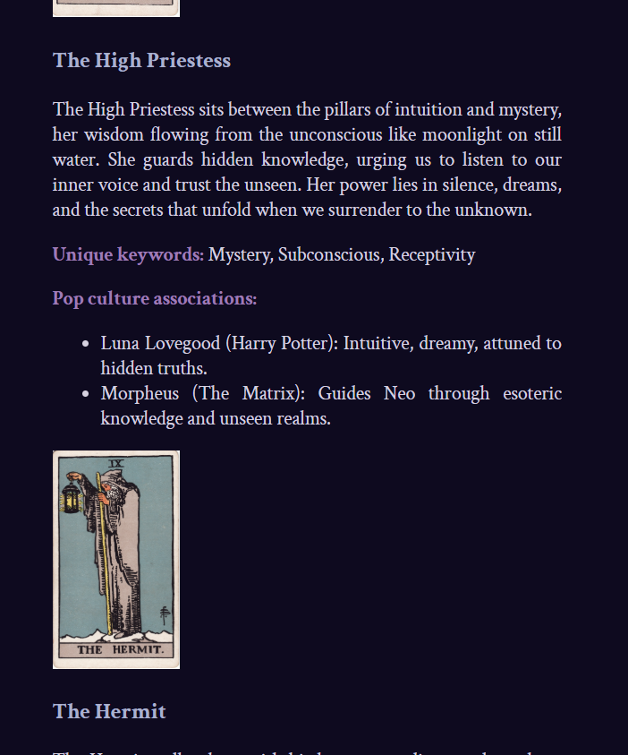

# 🌙 The High Priestess vs The Hermit - Tarot Card Comparison Page

This is a simple HTML and CSS project that showcases a comparison between **The High Priestess** and **The Hermit** cards from the Major Arcana of the Tarot.

> "The journey to wisdom is both a path of silence and seeking, where one finds truth through surrender and the other through contemplation."

## 🃏 About the Project
The page displays:
- High-quality tarot card illustrations of *The High Priestess* and *The Hermit*
- A comparison of the two cards, with a focus on their unique spiritual meanings and their connection to figures like **Saint Teresa of Ávila** and **Saint John the Baptist**
- Pop culture references that illustrate the cards' archetypes: **Luna Lovegood**, **Morpheus**, **Yoda**, and **Moana**
- A poetic interpretation of each card's message and symbolism

The design uses responsive CSS, ensuring the page looks great across various screen sizes through the use of media queries.

## 💡 Technologies Used

- **HTML5**
- **CSS3** (with focus on **Media Queries** for responsiveness)

This project is meant for practice and learning, where I wanted to apply **responsive design techniques** while incorporating **symbolism** and **storytelling** to present a deeper exploration of tarot.

## 📸 Screenshots

***

***

